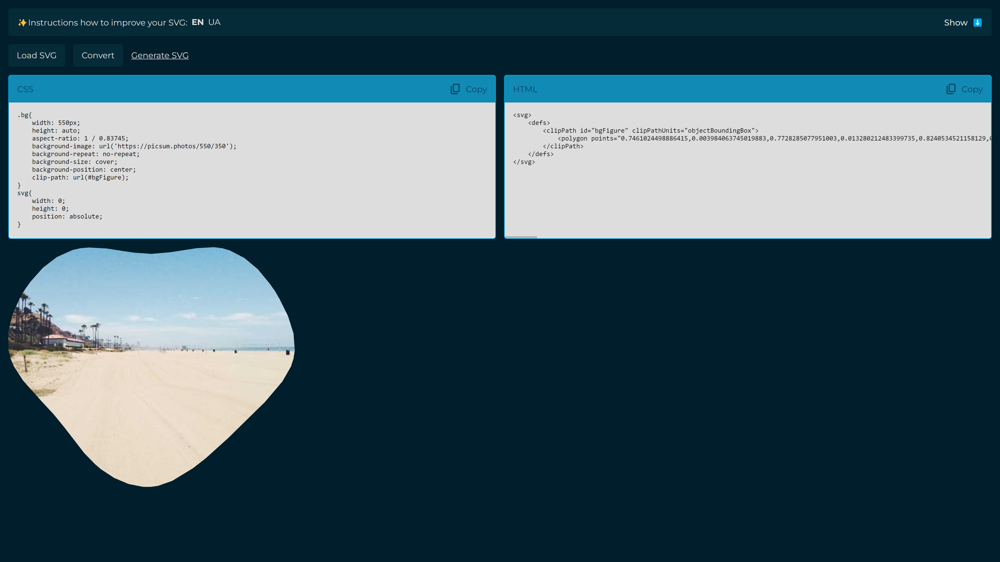

Clip-Path Creator
🚀 **Convenient Tool for Creating and Editing Clip-Paths from SVGs**

This tool allows you to easily and quickly convert any **SVG** into a **clip-path** that can be effortlessly edited and scaled using **CSS**. The core functionality is based on [**svg-path-to-polygons**](https://www.npmjs.com/package/svg-path-to-polygons) by Gavin Kistner (MIT License). I've extended the tool by adding several features and writing a guide on how to improve the quality of the resulting shape.
Key Features:
🔄 **Convert SVG paths to polygons** for cleaner and more manageable clip-paths.
📏 **Easily resize and edit** shapes through CSS for responsive design.
✨ **Optimized shapes** with normalization for consistent rendering across different devices.
📖 **Step-by-step instructions** included on how to enhance shape quality.
Example:
Here's an example of the tool in action:

